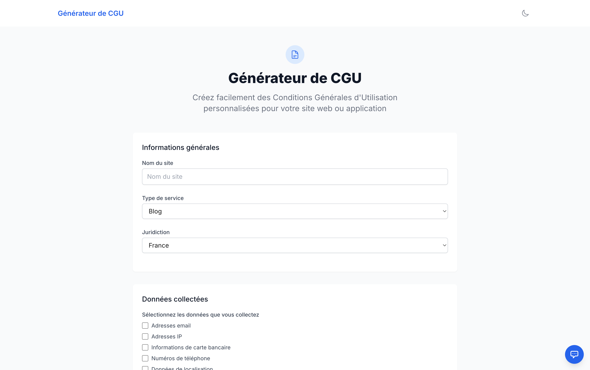
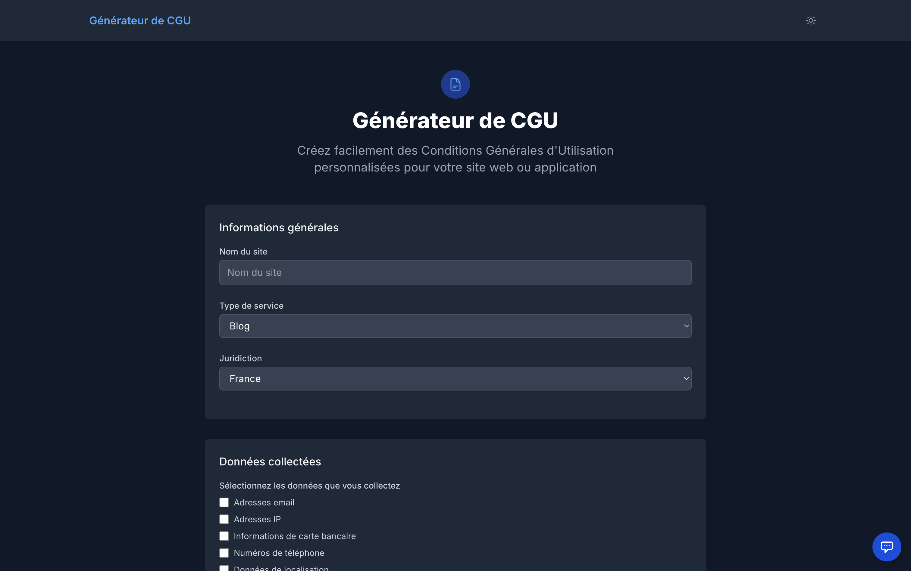

# 📄 CGU Generator

> Complete SaaS application for generating custom Terms of Service (CGU/TOS) in seconds. Free, fast, and legally-informed.

🔗 **[Live Demo → cgu-generator.com](https://www.cgu-generator.com/)** 


---

## 📸 Screenshots

### Multi-step Interactive Form

*Intelligent form with real-time validation and conditional fields based on service type*

### Generated CGU with Export Options

*Clean HTML output with PDF download, clipboard copy, and print options*

### Dark Mode Support

*Seamless dark/light mode switching with system preference detection*

---

## ✨ Features

### 🎯 Core Functionality
- **Smart Form Builder** - Multi-step wizard adapts to your service type
- **4 Service Types** - Blog, E-commerce, SaaS, Mobile applications
- **Multi-jurisdiction** - France, EU, US, International legal frameworks
- **Instant Generation** - Generate complete CGU in <2 seconds
- **Professional Export** - Download as PDF or copy HTML to clipboard

### 🎨 User Experience
- **Responsive Design** - Perfect experience on mobile, tablet, and desktop
- **Dark/Light Mode** - System preference detection with manual override
- **Form Persistence** - Never lose your progress (localStorage)
- **One-click Actions** - Copy, download, or print with a single click
- **Accessibility** - WCAG 2.1 compliant, keyboard navigation

### 🔒 Privacy & Compliance
- **GDPR Compliant** - Cookieless analytics with Plausible
- **No Data Storage** - 100% stateless, your data never touches a database
- **Privacy-first** - No tracking, no cookies, no personal data collection
- **Transparent** - Open source, auditable code

### 🛠️ Technical Excellence
- **Type-safe** - Full TypeScript coverage with Zod validation
- **Server-side PDF** - Puppeteer-powered professional PDF generation
- **Stateless Architecture** - Horizontally scalable, no state management
- **Fast Performance** - Optimized bundle, <150KB JavaScript
- **Email Feedback** - Built-in user feedback system with Nodemailer

---

## 🛠️ Tech Stack

| Layer | Technology | Purpose |
|-------|-----------|---------|
| **Framework** | Next.js 14 App Router | Server-side rendering, API routes |
| **Language** | TypeScript | Type safety, better DX |
| **Styling** | Tailwind CSS | Utility-first styling, responsive design |
| **Forms** | React Hook Form + Zod | Form management, schema validation |
| **PDF** | Puppeteer | Server-side PDF generation |
| **Icons** | HeroIcons | Beautiful SVG icon library |
| **Analytics** | Plausible | Privacy-first, GDPR-compliant analytics |
| **Email** | Nodemailer | Feedback system notifications |
| **Deployment** | Vercel | Edge functions, global CDN |

---

## 🚀 Quick Start

### Prerequisites
- Node.js 18+
- npm or pnpm

### Installation
```bash
# Clone the repository
git clone https://github.com/P4ST4S/cgu-generator.git
cd cgu-generator

# Install dependencies
npm install
# or
pnpm install

# Copy environment variables
cp .env.example .env.local

# Start development server
npm run dev
```

Open [http://localhost:3000](http://localhost:3000) to see the application.

---

## 📁 Project Architecture
```
src/
├── app/                    # Next.js 14 App Router
│   ├── page.tsx           # Home page with form
│   ├── result/            # Generated CGU display page
│   └── api/               # API routes
│       ├── generate/      # CGU generation endpoint
│       ├── pdf/           # PDF download endpoint
│       └── feedback/      # User feedback endpoint
├── components/
│   ├── ui/                # Reusable UI components
│   │   ├── button.tsx
│   │   ├── input.tsx
│   │   ├── select.tsx
│   │   └── textarea.tsx
│   ├── form/              # Form-specific components
│   │   ├── cgu-form.tsx
│   │   └── form-steps.tsx
│   └── feedback/          # Feedback widget
├── lib/
│   ├── types.ts           # TypeScript type definitions
│   ├── schema.ts          # Zod validation schemas
│   ├── generate-cgu.ts    # CGU generation logic
│   └── utils.ts           # Helper functions
└── hooks/
    ├── useAnalytics.ts    # Plausible analytics hook
    └── useTheme.ts        # Dark mode management
```

---

## ⚙️ Configuration

### Environment Variables

Create a `.env.local` file in the root directory:
```bash
# Analytics (Optional - Plausible)
NEXT_PUBLIC_ANALYTICS_DOMAIN=plausible.io
NEXT_PUBLIC_ANALYTICS_SITE_ID=cgu-generator.com

# Email Notifications (Optional)
EMAIL_HOST=smtp.example.com
EMAIL_PORT=587
EMAIL_USER=your@email.com
EMAIL_PASSWORD=your-password
EMAIL_RECIPIENT=feedback@cgu-generator.com
```

**Note:** The application works perfectly without any environment variables. Analytics and email features are optional enhancements.

---

## 🎯 Use Cases

### For Developers
- Quickly generate CGU for side projects
- Integrate legal documents into client projects
- Understand legal requirements for web applications

### For Startups
- Free alternative to expensive legal services
- Generate CGU before consulting a lawyer
- Quick compliance for MVP launches

### For Agencies
- Offer as a value-add service to clients
- White-label solution for legal document generation
- Save time on boilerplate legal documents

---

## 📈 Performance Metrics

| Metric | Score | Details |
|--------|-------|---------|
| **Lighthouse Performance** | 95+ | Optimized assets, lazy loading |
| **First Contentful Paint** | <1s | Critical CSS inline, code splitting |
| **Time to Interactive** | <2s | Minimal JavaScript, efficient hydration |
| **Bundle Size** | <150KB | Tree-shaking, dynamic imports |
| **CGU Generation** | <2s | Efficient template rendering |
| **PDF Generation** | ~3-5s | Server-side Puppeteer processing |

---

## 💡 Technical Highlights

### 1. Server-side PDF Generation
```typescript
// Using Puppeteer in Next.js API routes
import puppeteer from 'puppeteer';

export async function POST(request: Request) {
  const browser = await puppeteer.launch({
    headless: true,
    args: ['--no-sandbox', '--disable-setuid-sandbox']
  });
  
  const page = await browser.newPage();
  await page.setContent(htmlContent, { waitUntil: 'networkidle0' });
  
  const pdf = await page.pdf({
    format: 'A4',
    margin: { top: '20mm', right: '20mm', bottom: '20mm', left: '20mm' }
  });
  
  await browser.close();
  return new Response(pdf, { headers: { 'Content-Type': 'application/pdf' } });
}
```

### 2. Type-safe Form Validation
```typescript
// Zod schemas ensure type safety across the app
const formSchema = z.object({
  serviceType: z.enum(['blog', 'ecommerce', 'saas', 'mobile']),
  jurisdiction: z.enum(['france', 'eu', 'us', 'international']),
  companyName: z.string().min(1),
  // ... 20+ fields with conditional validation
}).refine(data => {
  // Custom validation logic based on service type
  if (data.serviceType === 'ecommerce') {
    return data.paymentMethods !== undefined;
  }
  return true;
});
```

### 3. Stateless Architecture
- No database required
- No session management
- Pure computation based on form inputs
- Horizontally scalable by design

### 4. Privacy-first Analytics
```typescript
// Plausible integration without cookies
useEffect(() => {
  if (window.plausible) {
    window.plausible('pageview');
    window.plausible('Form Submitted', { 
      props: { serviceType, jurisdiction } 
    });
  }
}, []);
```

---

## 🚀 Deployment

### Deploy to Vercel (Recommended)

1. **One-click deploy:**

[](https://vercel.com/new/clone?repository-url=https://github.com/P4ST4S/cgu-generator)

2. **Or via CLI:**
```bash
# Install Vercel CLI
npm i -g vercel

# Deploy
vercel --prod
```

### Other Platforms

This app can be deployed on any platform supporting Next.js:
- Netlify
- AWS Amplify
- Google Cloud Run
- Self-hosted with Docker

---

## 🧪 Development
```bash
# Development server
npm run dev

# Type checking
npm run type-check

# Linting
npm run lint

# Build for production
npm run build

# Start production server
npm start
```

---

## 🎓 What I Learned

Building this SaaS application taught me:

### Frontend
- ✅ Complex form state management with React Hook Form
- ✅ Advanced TypeScript patterns with discriminated unions
- ✅ Conditional form rendering based on user selections
- ✅ Dark mode implementation with Tailwind CSS
- ✅ Accessibility best practices (ARIA, keyboard navigation)

### Backend
- ✅ Next.js 14 App Router patterns and conventions
- ✅ Server-side PDF generation with Puppeteer
- ✅ API route design for serverless functions
- ✅ Environment variable management for multi-environment deployment

### Architecture
- ✅ Stateless SaaS design for horizontal scalability
- ✅ Type-safe schema validation with Zod
- ✅ GDPR-compliant analytics integration
- ✅ Performance optimization for Core Web Vitals

### Product
- ✅ User feedback loops and iteration
- ✅ Legal document structure and requirements
- ✅ Multi-jurisdiction compliance considerations
- ✅ UX design for complex form wizards

---

## ⚠️ Legal Disclaimer

**Important:** This application generates Terms of Service for informational and educational purposes only. While the generated documents follow common legal patterns and best practices, they should **not be considered legal advice**.

For production use, we strongly recommend:
1. Reviewing the generated document with a qualified lawyer
2. Customizing clauses to your specific business needs
3. Ensuring compliance with local regulations
4. Regular updates as laws and your business evolve

The creators of this tool are not responsible for any legal issues arising from the use of generated documents.

---

## 🤝 Contributing

Contributions are welcome! Please feel free to submit a Pull Request.

### How to contribute:

1. Fork the repository
2. Create a feature branch (`git checkout -b feature/amazing-feature`)
3. Commit your changes (`git commit -m 'Add amazing feature'`)
4. Push to the branch (`git push origin feature/amazing-feature`)
5. Open a Pull Request

---

## 📝 License

This project is licensed under the MIT License - see the [LICENSE](LICENSE) file for details.

---

## 📧 Contact & Links

**Antoine ROSPARS** - Full-Stack Developer

🌐 [Portfolio](https://antoinerospars.dev) • 💼 [LinkedIn](https://linkedin.com/in/antoinerospars) • 🐙 [GitHub](https://github.com/P4ST4S)

**Project Links:**
- 🔗 Live Demo: [cgu-generator.com](https://www.cgu-generator.com/)
- 📦 Repository: [github.com/P4ST4S/cgu-generator](https://github.com/P4ST4S/cgu-generator)
- 🐛 Report Bug: [Open an issue](https://github.com/P4ST4S/cgu-generator/issues)
- 💡 Request Feature: [Open an issue](https://github.com/P4ST4S/cgu-generator/issues)

---

## 🌟 Support

If you find this project useful, please consider:
- ⭐ Starring the repository
- 🐦 Sharing on social media
- 🔗 Linking from your project
- ☕ [Buying me a coffee](https://buymeacoffee.com/antoinerospars)

---

<div align="center">

**Made with ❤️ by [Antoine ROSPARS](https://antoinerospars.dev)**

*Helping developers and startups with legal compliance, one CGU at a time.*

</div>